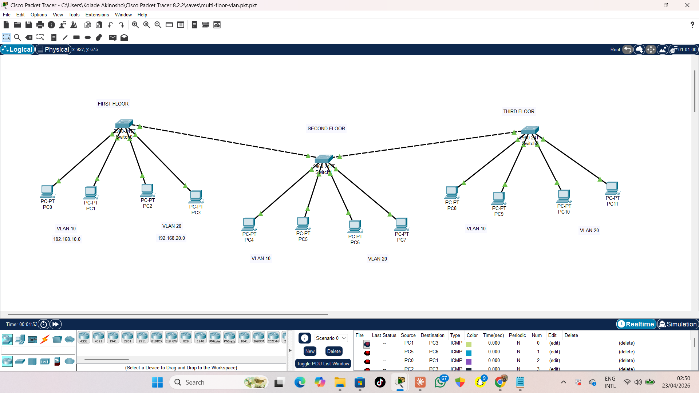

# Multi-Floor VLAN Configuration

## Overview
This project demonstrates a multi-floor network where VLANs are used to segment devices across three different floors.

## Topology

## What I Did
- Created VLAN 10 and VLAN 20 on all switches
- Assigned devices to VLANs on each floor
- Configured trunk links between switches
- Ensured VLANs extend across all floors

## Configuration
Basic commands used:
- vlan 10
- vlan 20
- switchport mode access
- switchport access vlan X
- switchport mode trunk

## Testing

- Devices in the same VLAN communicated successfully (even across floors)
- Devices in different VLANs were isolated

## Tools Used
- Cisco Packet Tracer

## Result
Successfully implemented VLAN segmentation across multiple floors with proper trunking between switches.
