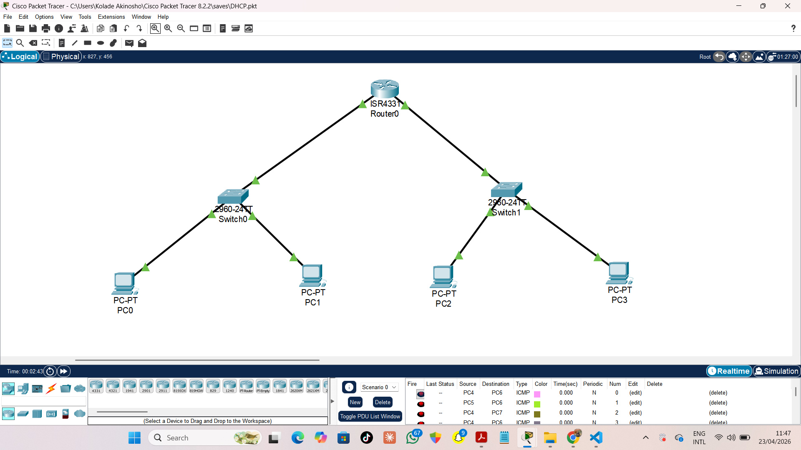
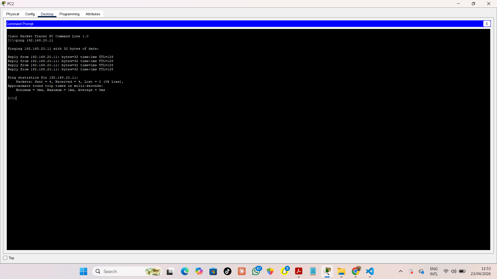

# DHCP Configuration

## Overview
This project demonstrates DHCP configuration using a router to automatically assign IP addresses to devices in the network.

## Topology

## Network Design
- 1 Router
- 2 Switches
- 2 PCs connected to each switch

The router acts as the DHCP server for all devices.

## What I Did
- Connected router to two switches
- Connected PCs to each switch
- Configured DHCP on the router
- Enabled automatic IP address assignment for all PCs

## Configuration
Key commands used:

- ip dhcp pool ADMIN
- network 192.168.20.0 255.255.255.0
- default-router 192.168.20.1
- dns-server 8.8.8.8

## Testing

- All PCs received IP addresses automatically
- Devices successfully communicated using assigned IPs

## Tools Used
- Cisco Packet Tracer

## Result
Successfully configured DHCP on a router to dynamically assign IP addresses to multiple devices across two switches.
