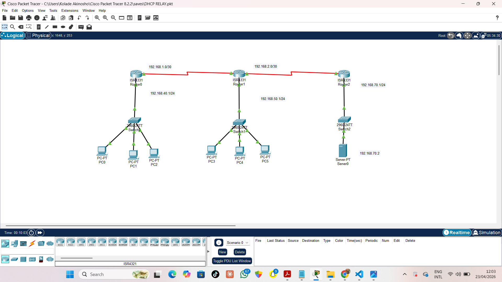
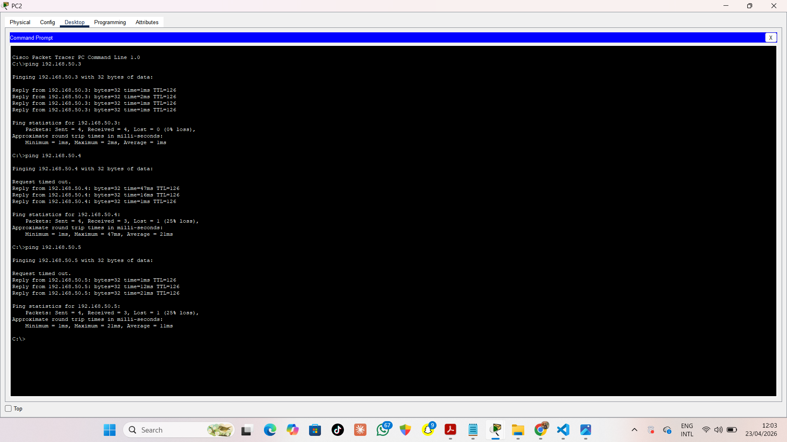

# DHCP Relay Configuration

## Overview
This project demonstrates DHCP relay configuration where a centralized DHCP server assigns IP addresses to clients across different networks.

## Topology

## Network Design
- 3 Routers
- 3 Switches
- 3 PCs on Switch 1
- 3 PCs on Switch 2
- 1 DHCP Server on Switch 3

DHCP requests are forwarded to the server using relay.

## What I Did
- Connected three routers to form separate networks
- Connected switches and end devices to each router
- Configured a DHCP server on the third network
- Enabled DHCP relay on routers using helper addresses
- Allowed devices on different networks to receive IP addresses

## Configuration
Key commands used:

Router (DHCP Relay):
- ip helper-address <DHCP-server-IP>

Server:
- Configured DHCP service
- Created address pools for each subnet

## Testing

- PCs received IP addresses from the remote DHCP server
- Communication between devices across networks was successful

## Tools Used
- Cisco Packet Tracer

## Result
Successfully implemented DHCP relay, allowing multiple networks to obtain IP addresses from a centralized DHCP server.
